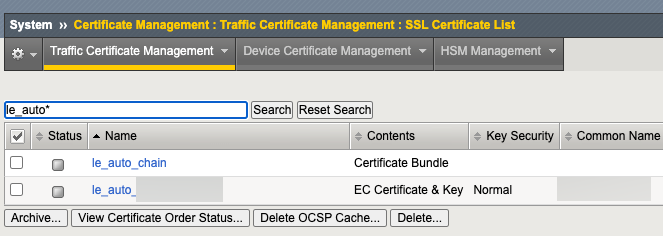
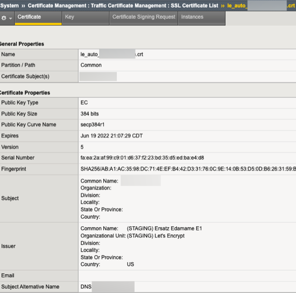

## Synopsis

This project is a rewrite of my original project ([archived](archive)) based on Lukas2511's letsencrypt.sh shell script 
as the basis for deploying certificates to an F5 BIG-IP. This update utilizes Lukas2511's 
[dehydrated](https://github.com/dehydrated-io/dehydrated)
acme client.

Secondly, this update uses the HTTP challenge instead of the DNS challenge I used in the original project.

Finally, it still utilizes F5's iControl REST interface to upload and configure the certificates, but I swap
out the mostly-retired [f5-sdk](https://github.com/f5networks/f5-common-python) library for the
[bigrest](https://github.com/leonardobdes/BIGREST) library.

**(Overridden by Tim Riker) Removed from this project altogether is the creation of client SSL profiles, as that is a separate function
than certificate management and should have its own workflow.

### [Tim Riker](https://rikers.org) added
* run as non-root in a working directory
* include full chain in .crt so no separate chain is needed
* create or update certs/keys
* create client-ssl profiles if missing
* irule uses a datagroup to handle multiple challenges for multiple names in a certificate.

## [Scott Campbell](https://github.com/ScottECampbell) September 2023

* Moved all environmental variables to configuration files so that this script can be used on multiple domains/certificates on the same run of dehydrated.
* Added ".f5creds" JSON file which gives the host, user and password for LB access.  The user defined MUST be a LB Administrator otherwise the REST API will not function properly.
* Added "virtual_servers" JSON file which maps the SSL certificate domains to their LB Virtual Server names since they do not always match **HTTP version of VS if available.
* Added logic for SAN certs where both domains need verification and irule will be attached (and attempted deletion) on both domains.
* Added variable to hook_script.py for SSL Client Parent Profile used for new SSL profiles with all desired settings included.
* Fixed logic bug that would break processing if met with VS with no existing irules on LB.
* Created bash script "cron_wrapper" so that process can be run from cron or command line and includes activation of correct python virtual environment (if required).

## Getting Started

Install dehydrated. On Debian based distros this probably works:

```bash
$ sudo apt install dehydrated
```

Install bigrest in python
```bash
$ pip install bigrest
```
Set CONTACT_EMAIL in config to your email.

register with dehydrated
```bash
$ dehydrated -f config --register --accept-terms
```

Edit virtual_servers file to include domain x Virtual Server mapping

Add your domains and aliases to domains.txt and try a request
```bash
$ dehydrated -f config -c --force --force-validation
```


## Test Setup
```bash
config # Dehydrated configuration file (edit CONTACT_EMAIL)
domains.txt # Domains to sign and generate certs for (add names and aliases)
virtual_servers # Domains x Virtual Servers mapping on F5 Loadbalancer
dehydrated # acme client (install)
bigrest # install python library
rule_le_challenge.iRule # iRule configured and deployed to BIG-IP by the hook script
hook_script.py # Python script called by dehydrated for special steps in the cert generation process

# Environment Variables (credentials moved to .f5creds file, vs_vip listings moved to virtual_servers file - S Campbell)
#export F5_HOST=f.q.d.n
#export F5_USER=admin
#export F5_PASS=admin
#export F5_HTTP=vs_vip-name_HTTP
#export F5_HTTPS=vs_vip-name_HTTPS
```
## Usage

### Testing - Stage API
```bash
$ dehydrated -f config -c --force --force-validation
```

### Otherwise
```bash
$ dehydrated -f config -c -g
or
$ cron_wrapper
```

## Expected Output

```bash
$ dehydrated -f config -c --force --force-validation
# INFO: Using main config file config
Processing example.com
 + Checking domain name(s) of existing cert... unchanged.
 + Checking expire date of existing cert...
 + Valid till Dec  7 17:08:55 2022 GMT (Longer than 30 days). Ignoring because renew was forced!
 + Signing domains...
 + Generating private key...
 + Generating signing request...
 + Requesting new certificate order from CA...
 + Received 1 authorizations URLs from the CA
 + Handling authorization for example.com
 + A valid authorization has been found but will be ignored
 + 1 pending challenge(s)
 + Deploying challenge tokens...
 + (hook) Deploying Challenge example.com
 + (hook) irule rule_le_challenge added.
 + (hook) datagroup dg_le_challenge added.
 + (hook) Challenge rule added to virtual vs_example.com_HTTP.
 + (hook) Challenge added to datagroup dg_le_challenge for example.com.
 + Responding to challenge for example.com authorization...
 + Challenge is valid!
 + Cleaning challenge tokens...
 + (hook) Cleaning Challenge example.com
 + (hook) Challenge rule rule_le_challenge removed from virtual vs_example.com_HTTP.
 + (hook) irule rule_le_challenge removed.
 + (hook) datagroup dg_le_challenge removed.
 + Requesting certificate...
 + Checking certificate...
 + Done!
 + Creating fullchain.pem...
 + (hook) Deploying Certs example.com
 + (hook) Cert/Key example.com updated in transaction.
 + Done!
```



## Caveats
I tested one use case for a standard domain. Let's Encrypt and dehydrated support far more
than I tested, so you'll likely need to do additional development to support those.

** S Campbell - added ability for multiple certificates including SAN certificates 
** virtual_servers file needs an entry for EACH SAN. Could investigate "HOOK_CHAIN=yes" functionality in dehydrated and then change hook script to deal with all SANs at once.

## Contributors

This update is made possible by:

* https://github.com/dehydrated-io/dehydrated
